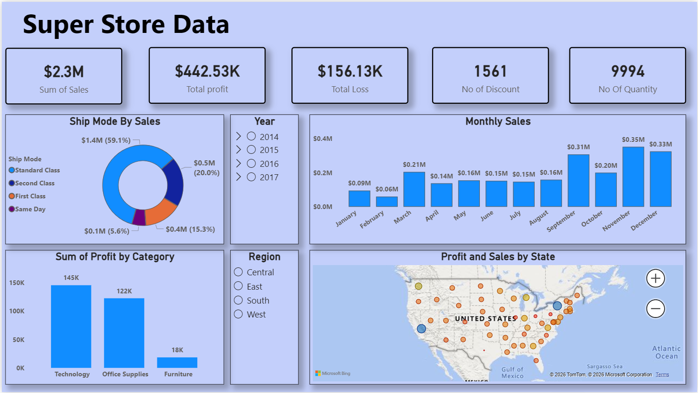

# 📊 Super Store Sales Dashboard

<p align="center">
  
</p>

<p align="center">
  <strong>Power BI Dashboard for Sales, Profit & Regional Performance Analysis</strong>
</p>

---

## 🎯 Project Overview

The Super Store Sales Dashboard is an interactive Power BI project designed to analyze sales, profit, discounts, and order performance using the Super Store dataset. The project transforms raw transactional data into meaningful business insights through KPI cards, charts, maps, and interactive filters. It helps stakeholders monitor business performance, identify profitable areas, and make data-driven decisions. The dashboard was developed using Power BI, Excel, Power Query, and DAX to provide a clear view of sales trends and regional performance. The analysis covers sales records from 2014 to 2017 and focuses on understanding customer behavior, shipping performance, and category profitability.

### Key Highlights

* Analyzed **$2.3M+ sales data** to evaluate overall business performance and profitability.
* Built interactive visualizations including KPI cards, sales trends, category analysis, and geographic mapping.
* Implemented Year and Region slicers for dynamic filtering and deeper business exploration.
* Generated actionable insights to identify top-performing categories, shipping modes, and sales patterns.

Super Store Sales Dashboard
```text
├── 📂 SuperStore Data (Excel Dataset)
│   │
│   ├── Orders
│   ├── Sales
│   ├── Profit
│   ├── Discount
│   └── Region
│
├── 🧹 Data Preparation
│   │
│   ├── Data Understanding
│   ├── Check Missing Values
│   ├── Fix Data Types
│   ├── Format Dates
│   └── Remove Errors
│
├── 🔄 Data Transformation
│   │
│   ├── Power Query
│   ├── Create Date Fields
│   └── Prepare Final Dataset
│
├── 📐 DAX Measures
│   │
│   ├── Total Sales
│   ├── Total Profit
│   ├── Total Loss
│   ├── Total Quantity
│   └── Total Discount
│
├── 📊 Dashboard Development
│   │
│   ├── KPI Cards
│   ├── Ship Mode Analysis
│   ├── Monthly Sales Trend
│   ├── Profit by Category
│   ├── State-wise Map
│   └── Year & Region Slicers
│
├── 🔍 Business Analysis
│   │
│   ├── Sales Performance
│   ├── Profitability Analysis
│   ├── Category Analysis
│   ├── Shipping Analysis
│   └── Regional Analysis
│
├── 💡 Key Insights
│   │
│   ├── Top Performing Category
│   ├── Highest Sales Months
│   ├── Best Performing Regions
│   └── Profit Drivers
│
└── 🎯 Business Decisions
    │
    ├── Increase Sales
    ├── Improve Profit
    ├── Reduce Losses
    └── Optimize Shipping
```
---

## 📈 Dashboard Snapshot

| KPI                 | Value    |
| ------------------- | -------- |
| Total Sales         | $2.3M    |
| Total Profit        | $442.53K |
| Total Loss          | $156.13K |
| Total Discounts     | 1,561    |
| Total Quantity Sold | 9,994    |

---

## 🔍 Key Features

✅ KPI Summary Cards

✅ Monthly Sales Trend Analysis

✅ Profit by Product Category

✅ Ship Mode Performance Analysis

✅ Interactive Year & Region Filters

✅ State-wise Sales & Profit Map

---

## 💡 Key Insights

* Standard Class contributes the highest share of sales.
* Technology is the most profitable category.
* Sales peak during the final quarter of the year.
* Regional analysis highlights high-performing states and profit opportunities.
* Discount levels have a direct impact on profitability.

---

## 🛠️ Tools & Technologies

| Tool        | Purpose               |
| ----------- | --------------------- |
| Power BI    | Dashboard Development |
| DAX         | KPI Calculations      |
| Power Query | Data Transformation   |
| Excel       | Data Source           |
| GitHub      | Version Control       |

---

## 📂 Repository Structure

```text
SuperStore-Sales-Dashboard/
│
├── SuperStore112.pbix
├── Superstore112.xlsx
├── README.md
└── SuperStore112.png
```

---

## 🚀 How to Use

1. Download or clone the repository.
2. Open `SuperStore112.pbix` in Power BI Desktop.
3. Refresh the dataset if required.
4. Explore the dashboard using filters and slicers.

---

## 👨‍💻 Author

**Shaik Sirajuddin**

📊 Data Analyst Aspirant
📈 Power BI | Excel | SQL | Python

---

⭐ If you found this project useful, consider giving it a star.
